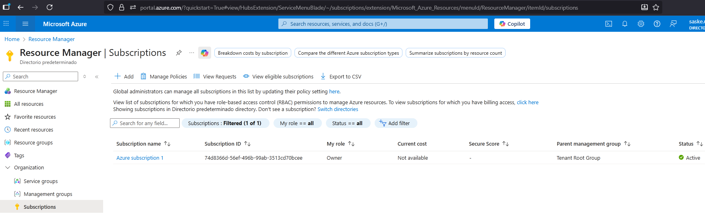
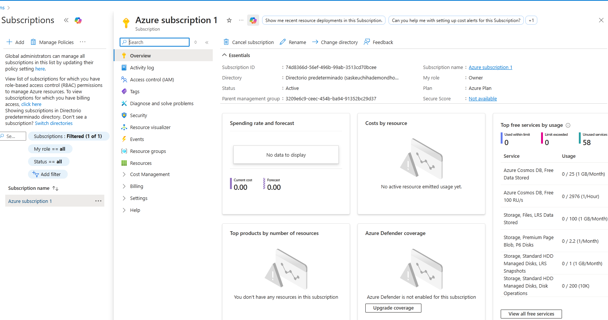
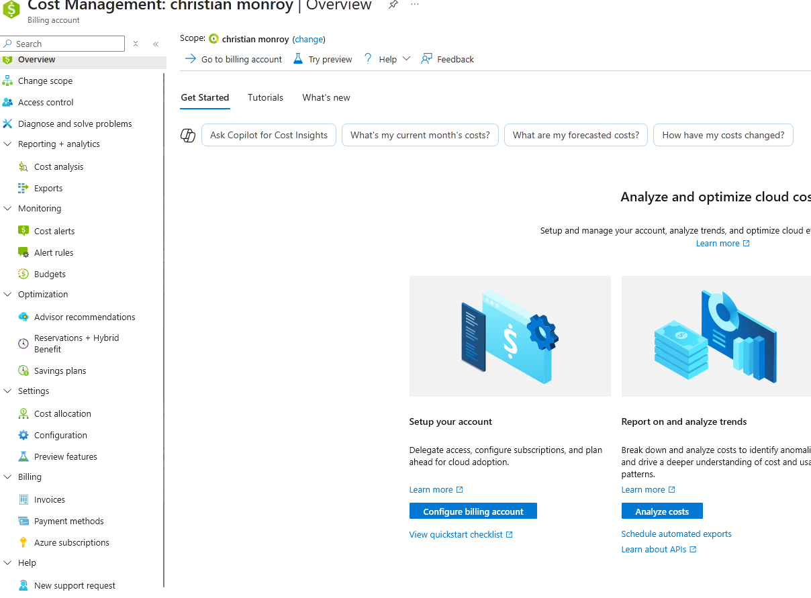
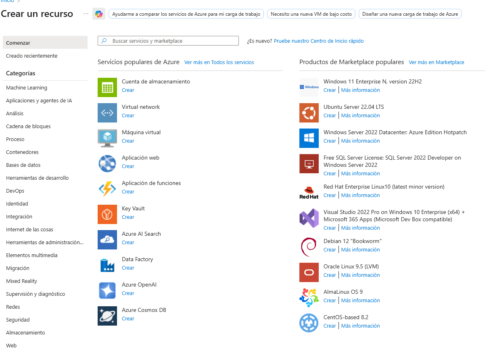

# Fundamentos del cloud Computing
La presentación respectiva trae por nombre __Fundamentos del cloud computing__ como PDF o como pptx.

El cloud se basa en la arquiectura cliente-servidor, se depende de internet totalmente. Se puede trabajar de manera offline gracias a algunas herramientas, pero siempre viene después la sincronización a través de internet con el servidor o cloud.

En la página 6 encontramos una definición del _cloud_. Con cloud se permite acceder a muchisimas cosas que se encuentran montadas o almacenadas en otro lado que no es localmente y que es provisto por un individuo u organización com olo puede ser Microsoft con su servicio cloud __Azure__.

Antes del Cloud existía algo como un _data center_ que tal cual son servidores que debe montar la empresa y esto trae muchas limitantes por el costo, tamaño físico y de almacenamiento virtual y tiempo de montar más data center.

Con cloud uno de subscribe por recursos en alguna parte del mundo. Ahí dentro podemos montar maquinas virtuales por poner un ejemplo. Con esto se paga menos, la insfraestructura no se la lleva la empresa, solo para por lo que usa en la nube.

## Características:
En cloud, se puede extender de manera casi infinita, mientras pagues claro, a este concepto se le denomina _elasticidad_, se puede crecer hasta donde la billetera alcance.

La _inmediatez_ es otro de sus puntos fuertes, los recursos del cloud se pueden usar inmediatamente. Crear una máquina virtual se hace en minutos.

Otro punto a destacar es la _concurrencia_ que tiene que ver con la capacidad de manejar peticiones o solicitudes de muchos clientes, o que se quiera mover una cantidad grande de datos en la bbd. Siendo _escalable_ hasta que la cartera lo permita.

Todos los provedores de cloud ofrecen un _autoservicio y bajo demanda_ que practicamente no esperar a que te lleven lo que necesitas, sino que tu solo puedes tomar lo que necesites y cuando lo necesites.

Los recursos a usar van por _ubicación_ o regiones, es como en los videojuegos online, se puede seleccionar a qué servidor te quieres conectar, que van por regiones, puede ser norteamérica, asia, subamérica, ... estas son las regiones que van por ubicación geográfica. Cada región tiene costos diferentes, no es lo mismo montar una máquina virtual en áfrica que en EU además que hay que considerar la _latencia_. 

## Métodos de entrega
En la nube, hay responsabilidades compartidas, algunas cosas quedan del lado del provedor y otras son nuestras. Cuando la responsabilidad es _on premise_ ya responsabilidad total es nuestra, es como trabajar en local o con un servidor privado.

Cuando el servicio que necesitamos es una infraestructura se conoce como __IaaS__ donde alquilamos el amacenamiento, los servidores, redes, máquinas virtuales.

La plataforma como serivicio __PaaS__ te deja solo en tus manos las aplicaciones y la data, todo lo demás es problema del provedor.

Y por último, encontramos el software as a Service __SaaS__, donde es un servicio a consumir, donde el cliente no mete las manos para nada, como un netflix o algo como ese tipo de servicios.

## Billing o Pricing
Los costos varian de qué nube se use, lo que vayas a necesitar de esa nube, es decir los recursos a necesitar, llamado usualmente como el modelo __on demand__. Cada nube tiene su _calculadora de precios_, en donde podemos simular lo que necesitaremos como una máquina virtual y sus especificaciones y su tiempo de uso. Hay personas que se dedican a solo este punto, minimizar costos pendendiendo de su uso. 

__Reserved:__ Si se requiere constantemente del servicio (mes con mes), entonces se puede optar por una subscripción o modelo de reserva, para esto se debe contactar con la empresa directamente, esto optimiza el billing.  

Y el último modelo es __spot__. Donde se paga minuto a minuto para servicios en tiempo real.

Los _CapEx_ son costos que tiene que ver con la infraestrestructura, como el costo de red, servidores, personal técnico, ... Pero estos se omiten o se incluyen en la subscripción al servicio cloud. Pero los _OpEx_ son los gastos de operación, que sí que los tienes que pagar, como lo es la renta de algún servicio en la nube o el escalado de estos servicios.

# Azure
Servicio cloud de Microsoft que permite construir, testear, desplegar y gestionar aplicaciones y servicios. Se integra con otros servicios de microsoft como el 365. Algunos de sus servicios son: data, análisis, desarrollo, computo, seguridad, almacenamiento, redes, ...

## Creando cuenta
Después de crear la cuenta desde le portal de azure, ingresamos a la página principal https://portal.azure.com/?quickstart=True#home 

Una cuenta puede tener n subscripciones y cada subscripción puede tener n cantidad de _grupos de recursos_ o resource group, el cual es un contenedor de recursos como una virual machine, virual network, Azure SQL, Storage, ... cada uno de estos se le llaman recursos o servicios.
## Subscripciones activas
Para saber las subscripciones activas o que tenemos nos vamos acá: https://portal.azure.com/?quickstart=True#view/HubsExtension/ServiceMenuBlade/~/subscriptions/extension/Microsoft_Azure_Resources/menuId/ResourceManager/itemId/subscriptions

Azure nos da una subscripción gratis con 200 dlls que al mes caduca o cuando se acabe el dinero.

Observa como el estatus es activo

Y dentro de cada subscripción tenemos algo como esto. Para __cancelar la subscripción__ tenemos que venir a esta parte y dar click en el botón de cancelar. Cada subscripción tiene su propio ID y nombre.

Desde home podemos ingregar a la administración de costos o cost management. Donde podemos ver las facturas, análisis, alertas, métodos de pago. 

## Documentación y aprendizaje
Azure cuenta con su propia _documentación_ la cual está acá: https://learn.microsoft.com/en-us/azure/?wt.mc_id=rmskilling_docs_onboarding_inproduct_gdc&product=popular

Para aprender a usar azure con la ayuda del propio microsoft tenemos un enlace: https://learn.microsoft.com/en-us/training/azure/?WT.mc_id=home_homepage-azureportal-learn&context=sso&source=azure-portal En donde veremos muchas rutas de aprendizaje que cuentan con varios módulos para cada uno de sus servicios de manera gratuita. __Para sacar una certificación aquí es donde vienen los cursos para el examen.__, Azure así como otras nubes te ofrecen un entorno de trabajo o laboratiorio, donde se hacen pruebas. Incluso existe un apartado de __roles__, donde podremos ver todos las rutas y módulos específicos de un admin de base de datos por ejemplo.

Si desde inicio le damos a crear un recurso, nos llevará ala pantalla donde se muestran todos los recursos que tiene Azure. https://portal.azure.com/?quickstart=True#view/Microsoft_Azure_Marketplace/PlusNew.ReactView/package/hub/additionalConfig~/%7B%7D/selectedMenuItemId/undefined/createLanding/undefined  igualmente para los grupos de recursos.

Se puede interactuar de tres maneras con Azure, desde su portal como hasta ahora, desde el Azure powershell, con línea de comandos y desde el télefono con Azure mobile.

## Seguridad
Se puede limitar el acceso a los recursos a 3 niveles, a nivel de subscripción, grupo de recursos y recurso. Que le demos permiso a una persona a nivel de subscripción no significa que pueda modificar todo, ya que debe tener permisos para esto, sino que tendrá acceso a todo lo que contiene esa subscripción, es decir a los grupos y recursos. Se recomienda dar permisos solo a los recursos a utilizar. Se pueden crear grupos con ciertos usuarios a los cuales les das permiso para algún recurso o grupos de recursos.