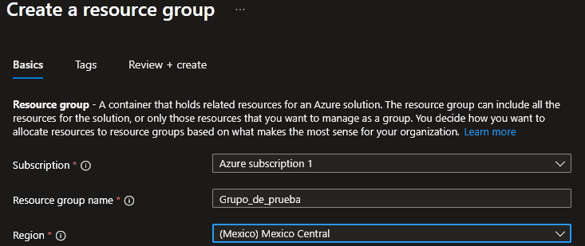
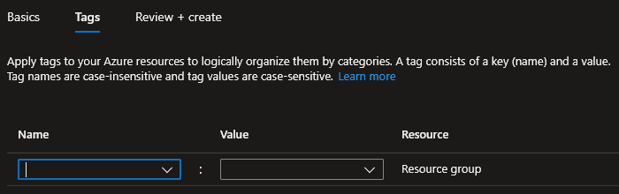
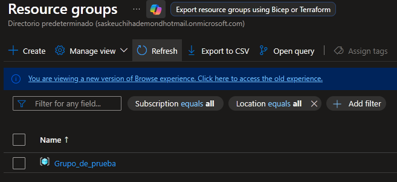
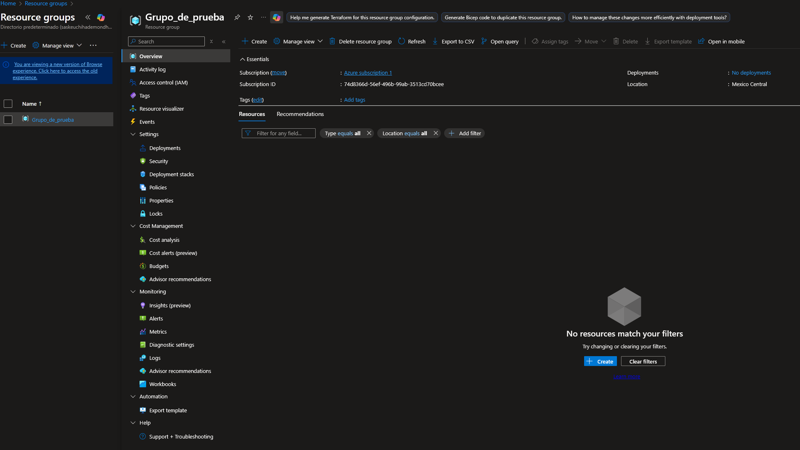
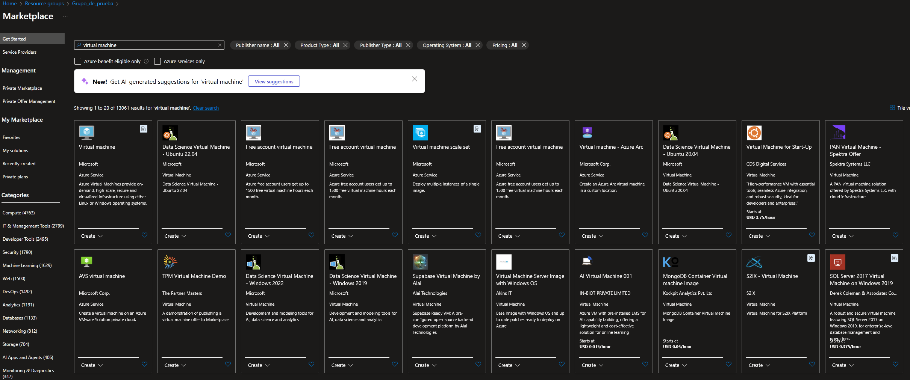
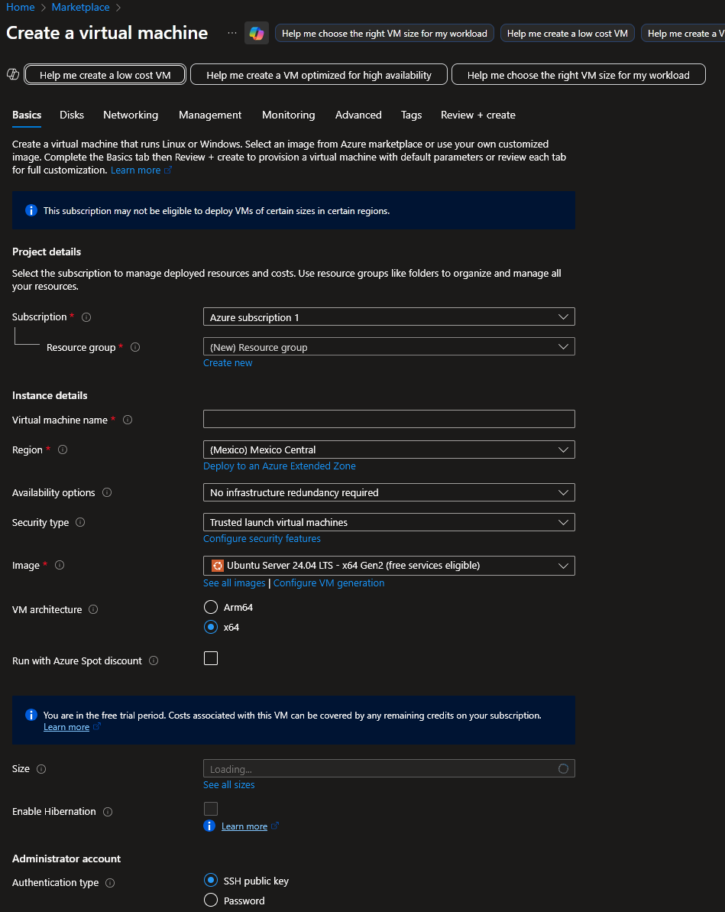
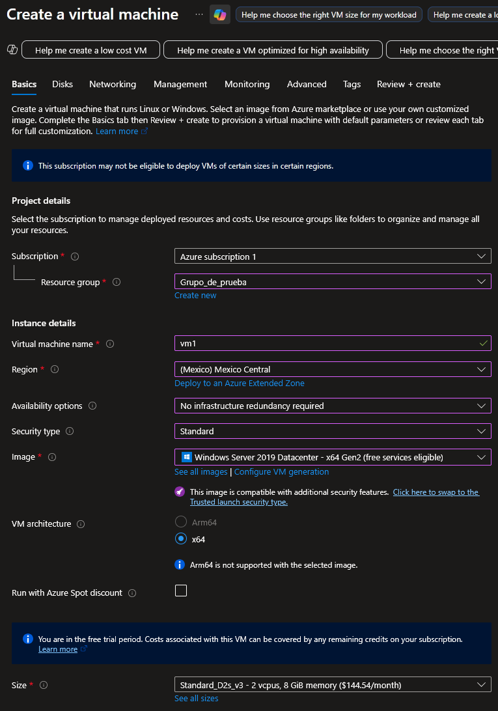

# Servicio de redes en Azure
## Introducción
### Máquinas virtuales
En pocas palabras es como rentar una pc con un sistema operativo , pero esta __vm (virtual machine)__ emula una pc física, con todos sus componentes pero sin serlo. Las vm tienen un disco virtual donde se almacenan los datos y so que parte del disco físico que la pc tiene instalado, un aplaca de red virtual, direcciones de ip y grupos de reguridad de red, estos últimos ayudan a gestionar los permisos para lás máuinas vituales, p.e, desde donde me puedo conectar a esa vm.

Todos estos componentes y propiedades son al gusto del cliente, mientras la cartera lo permita.

#### Práctica
En el inicio de la web de Azure, aparece el ícono de __resouce group__ donde nos solicita que subscripción seleccionar, el nombre del grupo de recursos y la región donde se alojará físicamente nuestros recursos.

Dentro de la pestaña de __Tags__ se encuentra un apartado para colocar una etiqueta más específica al grupo con un nombre y un valor (llave:valor) 

En Review + create se ve un resumen. Le damos a _create_ y se genera automáticamente. En caso que no se vea el grupo le damos a _refresh_

 

Y dandole click al grupo de recurso veremos toda la información que podemos modificar para el grupo 

Se pueden dar permisos a nivel se subscripción, grupo y recursos. Para el primer nivel, se navega al apartado de subscripciones desde el inicio y seleccionamos __Access control (IAM)__, y le podemos dar permisos de administrador y demás, para el grupo es lo mismo. También se pueden crear alertas de costos, prepuestos, métricas ... lo mismo que en las subscripciones.

Para crear la máquina virual es tan sencillo como darle al botón de _create_ y seleccionar que recurso queremos.  Nos da miles de opciones de tipos de máquina virtual y otros servicios.

Damos click en __virtual machine__ (la primer opcion de la imagen) y podemos especificar las propiedades y capacidades de la vm a crear.

Verificamos a qué subscripción y grupo pertenecerá esta vm, así como al región, que puede ser diferente a la del grupo pero no muy recomendable, así como la seguridad, so, ...

La cuestión de la disponibilidad va para distibuir los datos o crear copias de la vm en otras regiones o servidores de azure. 

